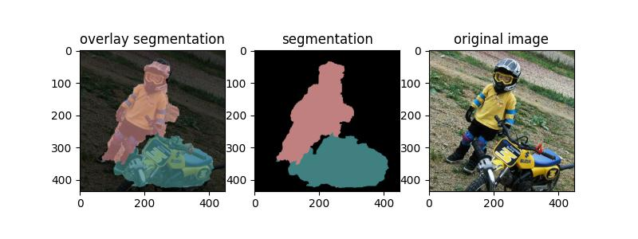

# some inplementation of segmentation algorithms

---
## models
### |FCN8s |FCN16s |U-net |DeepLabV1 |DeeplabV2 |

## examples

---
## home page
[github home page](https://github.com/dashboard)

---
## usage
### enviroment preparation
[enviroments](https://github.com/jhz6353/segmentation-algorithms/edit/main/requirements.txt)

---
## data preparation
### dataset
we use VOC2012 to train our model
[data download](https://github.com/dataset-ninja/pascal-voc-2012/blob/main/DOWNLOAD.md)
#### recommended data file structure
- your working directory 
  - dataset
    - VOC2012  
      - Annotations  
      - ImageSets  
      - JPEGImages  
      - SegmentationClass  
      - SegmentationObject
  - output
  - model.py
  - dataloader.py
  - train.py
  - test.py
  - other files

---
### usage
#### train from scratch
`python train.py --epoches 50 --batch_size 4 --datapath "dataset/VOC2012" --resume False`
#### train from resume
`python train.py --epoches 50 --batch_size 4 --datapath "dataset/VOC2012" --resume FCN_8s/last_madel.pth`
#### predict
`python test.py --model FCN_8s --img_path your image path --output_save_path "output"`
